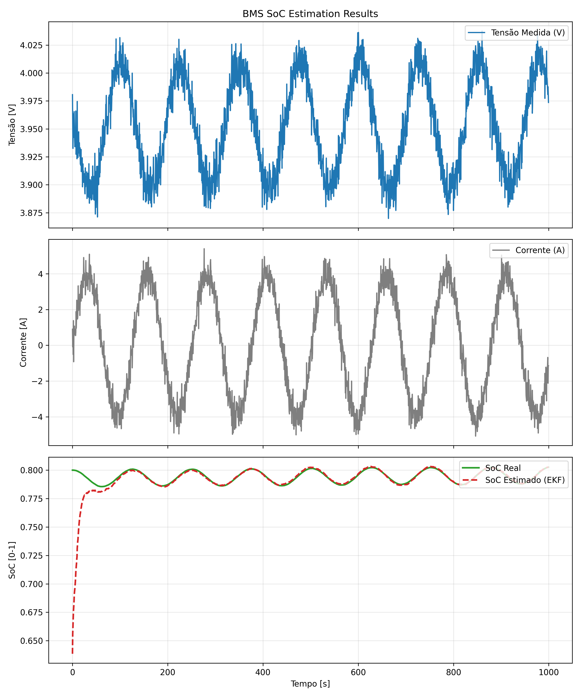
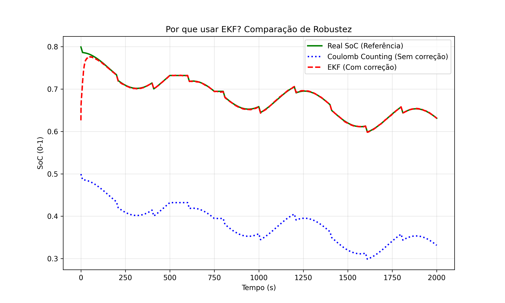
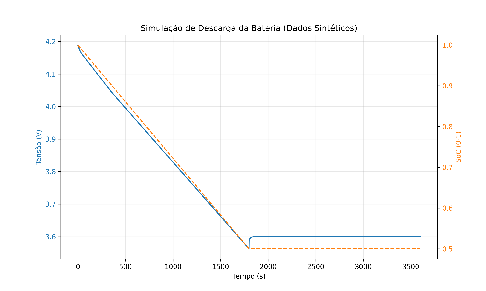

# 🔋 BMS State of Charge (SoC) Estimator via EKF


This project implements an **Extended Kalman Filter (EKF)** to estimate
the **State of Charge (SoC)** of a Lithium-Ion battery. It simulates a
realistic **Battery Management System (BMS)** environment, demonstrating
how to compensate for sensor noise and voltage relaxation dynamics using
sensor fusion.

------------------------------------------------------------------------

## 🧠 Overview

Accurate SoC estimation is critical for Electric Vehicle (EV) safety and
range prediction. Simple voltage reading is insufficient due to the flat
OCV curve of Li-Ion cells and internal resistance drops during
acceleration.

**This project solves this by:**

1.  **Modeling** the battery physics using a **Thevenin Equivalent
    Circuit (1st Order)**.
2.  **Simulating** real-world driving cycles (UDDS-like current pulses,
    discharge, regeneration).
3.  **Applying an EKF** to fuse current integration (Coulomb Counting)
    with voltage feedback, correcting initialization errors and sensor
    noise.

------------------------------------------------------------------------

## ⚙️ Mathematical Modeling

### 1. State Space Model (Process)

The system state evolves according to:

$$
x_{k+1} = \begin{bmatrix} 1 & 0 \\ 0 & e^{-\Delta t / \tau} \end{bmatrix} x_k + \begin{bmatrix} -\frac{\Delta t}{Q_n} \\ R_1(1 - e^{-\Delta t / \tau}) \end{bmatrix} I_k
$$

Where the state vector $x$ contains:
* $x[0] = SoC$ (State of Charge)
* $x[1] = V_{c1}$ (Polarization Voltage across the RC pair)

### 2. Observation Model (Measurement)
The measured terminal voltage $y_k$ is non-linear relative to the SoC:

$$y_k = OCV(SoC_k) - V_{c1, k} - I_k R_0$$

The EKF linearizes the $OCV(SoC)$ curve at each time step to compute the Kalman Gain ($K$), allowing the system to "lock" onto the true SoC even with high sensor noise (Gaussian white noise).

------------------------------------------------------------------------

## 🧩 Folder Structure

    📂 BMS-SoC-Estimator
    ├── data/
    │   └── drive_cycle.csv
    ├── images/
    ├── notebooks/
    ├── src/
    │   ├── battery_model.py
    │   ├── ekf.py
    │   └── utils.py
    ├── tests/
    ├── validation/
    │   └── validate_model.m
    ├── main.py
    └── requirements.txt

------------------------------------------------------------------------

## 🚀 How to Use

### 1. Installation

``` bash
git clone https://github.com/VoIkmer/BMS-SoC-Estimator.git
cd BMS-SoC-Estimator
pip install -r requirements.txt
```

### 2. Generate Data (Optional)

``` bash
python generate_data.py
```

### 3. Run the Simulation

``` bash
python main.py
```

------------------------------------------------------------------------

## 📊 Results

### EKF Convergence Test

The filter successfully converges from an incorrect initial estimate:

-   **Real SoC:** 80% (0.8)
-   **EKF initial guess:** 50% (0.5)

<p align="center">
    
</p>

> **Figure:** Full simulation showing the EKF (Red) correcting the initial error and tracking the Real SoC (Green) despite current fluctuations.

------------------------------------------------------------------------

## 🛠️ Tech Stack

  Component       Technology    Description
  --------------- ------------- ----------------------------
  Core Logic      Python 3.12   EKF implementation
  Math Engine     NumPy         Matrices and Jacobians
  Visualization   Matplotlib    Plotting
  Validation      MATLAB        Cross-check implementation

------------------------------------------------------------------------

## ❓ FAQ (Frequently Asked Questions)

### 1. Why use an Extended Kalman Filter (EKF) instead of simple Coulomb Counting?
Coulomb Counting (current integration) is precise in the short term but suffers from **drift**—small sensor errors accumulate over time, leading to huge inaccuracies after hours of operation. The EKF fuses this integration with voltage measurements to "correct" the SoC estimate in real-time, preventing drift even if the initial guess is wrong.

<p align="center">
  
</p>

> **Figure:** Comparison showing Coulomb Counting (Blue) failing to correct an initial error, while EKF (Red) converges to the True SoC (Green).

### 2. Why not just measure the battery voltage to determine SoC?
Lithium-Ion batteries have a very **flat OCV (Open Circuit Voltage) curve** between 20% and 80% charge. A voltage change of just 0.01V could represent a 10% difference in charge. Additionally, under load, the terminal voltage drops due to internal resistance ($R_0$). The EKF enables us to estimate SoC accurately even inside this "flat region" and under heavy load.

<p align="center">
    
</p>

> **Figure:** Example of a flat OCV curve.

### 3. Is this code ready for an embedded microcontroller (e.g., STM32, ESP32)?
This Python project serves as a **Model-in-the-Loop (MIL)** validation. For embedded deployment, the matrix operations (currently handled by NumPy) would need to be ported to C/C++ using a library like **CMSIS-DSP** or **Eigen**. However, the logic and the State-Space matrices remain exactly the same.

### 4. How did you validate the physics model?
The model was cross-validated using a **MATLAB** script (available in the `validation/` folder). The outputs from both Python and MATLAB were compared, yielding a Mean Squared Error (MSE) lower than $10^{-4}$, confirming that the discrete-time implementation of the differential equations is mathematically sound.

<p align="center">
    
</p>

> **Figure:** Overlay of Python implementation vs MATLAB reference. The curves are indistinguishable, validating the math engine.

### 5. Why do we see voltage recovery when the current stops?
This is the **relaxation effect** caused by the polarization of Lithium ions. It is modeled in this project by the RC parallel branch ($R_1, C_1$) in the Thevenin circuit. The EKF uses this recovery curve to refine its internal estimation of the battery's true chemical state.

<p align="center">
  
</p>

> **Figure:** The OCV curve of a Li-Ion battery. Note the flat region where voltage barely changes despite huge capacity variation.

## 🧑‍💻 Author

**Carlos Eduardo**\
Electrical Engineering Student 


📧 Email: cguimaraesbarbosa03@gmail.com\
🌐 GitHub: https://github.com/VoIkmer

------------------------------------------------------------------------

## 📚 License

Licensed under the **MIT License**.


